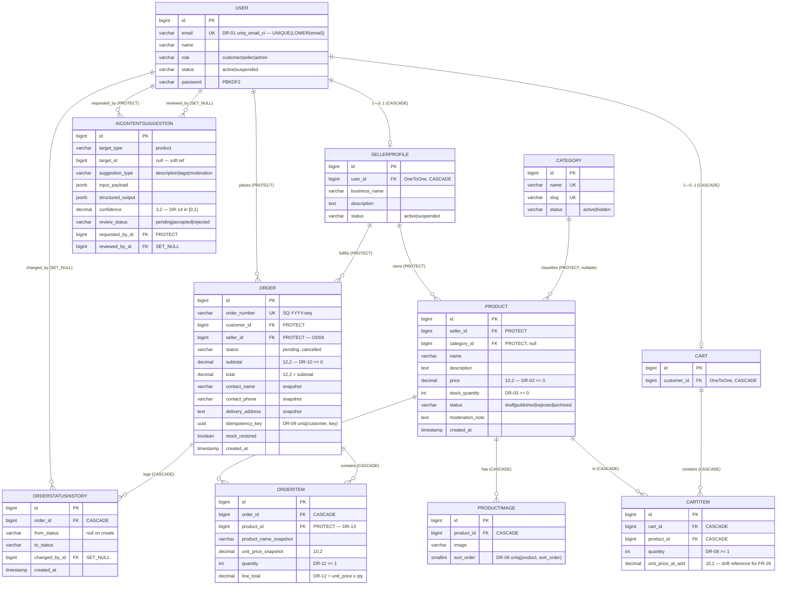

# Database Design — ERD · Normalization · Indexing

**Reference:** SRS v1.0 §4 (Data Requirements) · DR-01..DR-14
**Stack:** PostgreSQL 16 · Django 5.x ORM
**Status:** Documentation of approved schema — no redesign.

---

## 1. ERD

**Relationship Notes:**

| # | Relationship | Rationale |
|---|---|---|
| R-01 | `User 1—0..1 SellerProfile` | `customer` role does not create profile; created only when `role=seller` (FR-04) |
| R-02 | `User 1—0..1 Cart` | `OneToOne` = one active cart, no guest cart (OD02) |
| R-03 | `Order —> SellerProfile` direct | Result of single-seller cart (OD04): each order maps to one seller, no order itemization across sellers |
| R-04 | `OrderItem —> Product` with `PROTECT` | Product once sold is never actually deleted; soft deletion via `status=archived` (FR-51, DR-13) |
| R-05 | `AIContentSuggestion.target_id` without FK | Polymorphic soft reference — suggestion may precede product creation (`target_id = null`) |
| R-06 | `changed_by` with `SET_NULL` | User deletion does not erase order history — audit trail persists |

---

## 2. Normalization

### 2.1 Normalization Assessment per Table

| Table | 1NF | 2NF | 3NF | BCNF | Note |
|---|:-:|:-:|:-:|:-:|---|
| `User` | ✅ | ✅ | ✅ | ✅ | `email` is candidate key (DR-01) — all determinants are keys |
| `SellerProfile` | ✅ | ✅ | ✅ | ✅ | `user_id` is candidate key |
| `Category` | ✅ | ✅ | ✅ | ✅ | `name` and `slug` are candidate keys; `slug` derived from `name` but immutable after creation (permalink) |
| `Product` | ✅ | ✅ | ✅ | ✅ | All attributes depend on `id` alone |
| `ProductImage` | ✅ | ✅ | ✅ | ✅ | `(product_id, sort_order)` is candidate key (DR-06) |
| `Cart` | ✅ | ✅ | ✅ | ✅ | Lightweight relationship table |
| `CartItem` | ✅ | ✅ | ✅ | ✅ | `(cart_id, product_id)` is candidate key (DR-07) — `quantity` fully depends on it. `unit_price_at_add` is a point-in-time snapshot, not a copy of `Product.price` — see N-09 |
| `Order` | ✅ | ✅ | ⚠️ | ⚠️ | Intentional denormalization — §2.2 |
| `OrderItem` | ✅ | ✅ | ⚠️ | ⚠️ | Snapshots + derived fields — §2.2 |
| `OrderStatusHistory` | ✅ | ✅ | ✅ | ✅ | Append-only, no updates |
| `AIContentSuggestion` | ✅ | ✅ | ✅ | ✅ | `JSONField` does not violate 1NF logically: content is opaque payload, no sub-attribute queries |

**1NF:** No multi-valued fields or repeating groups. Images in separate table (`ProductImage`) not in array column. Tags not stored as table because they exist only inside pending AI output (§7.1) — when accepted, written to `Product.description`, so no `Tag` entity in MVP.

**2NF:** No table has a natural composite key — all use `BigAutoField` surrogate key, making partial dependencies structurally impossible.

**3NF:** No transitive dependencies except in intentional cases below.

### 2.2 Intentional Denormalization

These are not defects — each is an explicit SRS requirement, each guarded by a database constraint or business rule:

| # | Field | Violation Type | Rationale | Guard |
|---|---|---|---|---|
| N-01 | `OrderItem.product_name_snapshot` | Transitive dependency (`product_id → name`) | **Historical immutability**: updating product name later must not change any historical order (FR-33) | Written only once during checkout transaction |
| N-02 | `OrderItem.unit_price_snapshot` | Transitive dependency (`product_id → price`) | Same — order is financial record, not view over catalog | Read from `Product` under `SELECT ... FOR UPDATE` (FR-27) |
| N-03 | `OrderItem.line_total` | Derived field (`= unit_price × quantity`) | Avoid recalculation on every read, pin financial figure | **DR-12** `CheckConstraint(line_total = unit_price_snapshot * quantity)` — drift impossible even from `manage.py shell` |
| N-04 | `Order.subtotal` | Derived field (`= SUM(line_total)`) | Order total is contractual number, not query result | Computed once per transaction (FR-31); DR-10 forbids negative |
| N-05 | `Order.total` | Copy of `subtotal` | Placeholder for future tax/shipping; in MVP `total = subtotal` (OD09) | DR-10 |
| N-06 | `Order.seller` | Derived from `items[].product.seller` | Single-seller cart (OD04) makes it invariant across order; storing it converts seller lookup (FR-52) from 3-way JOIN to single-column filter | Derived once from cart at creation time |
| N-07 | `Order.contact_name / contact_phone / delivery_address` | Copies of user data | Address at order time ≠ current address (FR-35) | Text snapshot, no FK |
| N-08 | `Order.stock_restored` | Procedural flag | Prevents duplicate stock restoration on repeated cancellation (FR-42, T-17) | Flipped within same cancellation transaction |
| N-09 | `CartItem.unit_price_at_add` | Snapshot of `product_id → price` | **Price drift is undetectable without it** — FR-25/26 must compare the price the customer saw against the current one, and nothing else in the schema records the former | Never read for money: every total comes from `Product.price` under `SELECT … FOR UPDATE` (FR-30). Rewritten on every add/update |

**Governing Rule:** Any denormalization in this schema is either (a) a historical snapshot that must not track the source, or (b) a derived field constrained by `CheckConstraint`. No field is duplicated "for speed only" without a guard.

`# ponytail: derived columns guarded by CHECK constraints, not by application code — the only denormalization that stays honest`

---

## 3. Indexing

### 3.1 Automatic Indexes (not written manually)

Django/PostgreSQL create these implicitly — **adding them manually = redundant index that slows writes:**

| Table | Automatic Index | Source |
|---|---|---|
| All tables | `PRIMARY KEY (id)` | Implicit B-tree |
| `Product` | `seller_id`, `category_id` | Automatic FK index |
| `ProductImage` | `product_id` | FK |
| `CartItem` | `cart_id`, `product_id` | FK |
| `Order` | `customer_id`, `seller_id` | FK |
| `OrderItem` | `order_id`, `product_id` | FK |
| `OrderStatusHistory` | `order_id`, `changed_by_id` | FK |
| `AIContentSuggestion` | `requested_by_id`, `reviewed_by_id` | FK |
| `SellerProfile` | `user_id` (UNIQUE) | OneToOne |
| `Cart` | `customer_id` (UNIQUE) | OneToOne |
| `User` | `email` (UNIQUE) | `unique=True` |
| `Category` | `name`, `slug` (UNIQUE) | `unique=True` |
| `Order` | `order_number` (UNIQUE) | `unique=True` |

> **The one deliberate exception to "no redundant indexes":** `User` carries both a plain B-tree on `email` (`unique=True`) and the functional `UNIQUE(LOWER(email))` of DR-01. They are different indexes serving different predicates — the functional one cannot answer `WHERE email = ?` and the plain one cannot enforce case-folded uniqueness. Both are required; this is not an oversight.

### 3.2 SRS-Mandated Indexes

Uniqueness constraints also serve as queryable indexes:

| ID | Index | Dual Purpose |
|---|---|---|
| DR-01 | `UNIQUE (LOWER(email))` on `User` | Case-insensitive uniqueness **+** accelerates login lookup |
| DR-04 | `INDEX (status, -created_at)` on `Product` | Core catalog query: `WHERE status='published' ORDER BY created_at DESC` (FR-07, FR-12) |
| DR-06 | `UNIQUE (product_id, sort_order)` on `ProductImage` | Image ordering + serves `ORDER BY sort_order` per product (FR-14) |
| DR-07 | `UNIQUE (cart_id, product_id)` on `CartItem` | Makes replace-semantics structural (FR-18) + row lookup on add |
| DR-09 | `UNIQUE (customer_id, idempotency_key)` on `Order` | Last-line defense vs. duplicate orders (EC05) **+** idempotency check at checkout start is index scan not seq scan |

### 3.3 Suggested Additional Indexes (derived from §5 query paths)

Each is tied to an actual API query — no speculative indexes:

| ID | Index | Query It Serves | Trace |
|---|---|---|---|
| IX-01 | `Order (customer_id, -created_at)` | `GET /api/orders/` — user's order list ordered by newest | FR-47 |
| IX-02 | `Order (seller_id, status)` | `GET /api/seller/orders/?status=` + dashboard counters | FR-52, FR-54 |
| IX-03 | `Product (seller_id, status)` | `GET /api/seller/products/` (queryset filtered by owner) + catalog filter `?seller=` | FR-50, FR-11 |
| IX-04 | `OrderStatusHistory (order_id, created_at)` | Order timeline ordered | FR-48 |

> **Known cost — the catalog's suspension filter.** FR-59 hides a suspended seller's products, which makes `GET /api/products/` a two-level join (`Product → SellerProfile → User`) that DR-04's `(status, -created_at)` does not cover, against NFR-01's 500 ms p95 budget. Mitigation for MVP: `SellerProfile.status` is mirrored from `User.status` on suspend (FR-59), so the filter needs only `Product → SellerProfile` — one join, served by the automatic FK index. `# ponytail: one join; denormalize a seller_active flag onto Product only if the catalog query actually misses its p95`

> **Avoid Duplication:** Each `IX-*` index starts with an FK column that has automatic indexing in §3.1 — the composite prefix covers the same lookup, making the automatic index redundant. When adding `IX-01..IX-04`, set `db_index=False` on corresponding FK fields (`Order.customer`, `Order.seller`, `Product.seller`, `OrderStatusHistory.order`).

> `IX-01..IX-03` composite with intentional order: equality column first, then sort/filter column second — allows index to serve both filtering and ordering without external sort.

**Intentionally Rejected Indexes:**

| Rejected | Why |
|---|---|
| Index on `Product.price` | Price ordering (FR-11) comes after `status='published'` filter served by DR-04; MVP scale doesn't justify a second index |
| GIN / `SearchVector` on `name, description` | `ILIKE` search sufficient to ~10k products (SRS §3.2). `# ponytail: seq scan on ILIKE, add GIN trigram index when catalog exceeds ~10k rows` |
| Index on `Order.status` alone | `IX-02` covers it for sellers; Admin query (FR-58) is rare and low-volume |
| Index on `AIContentSuggestion.review_status` | Table size bounded by 10/hour rate limit per seller (NFR-08) — seq scan acceptable |

### 3.4 Check Constraints (not indexes, but part of schema integrity)

| ID | Constraint | Table |
|---|---|---|
| DR-02 | `CHECK (price >= 0)` | `Product` |
| DR-03 | `CHECK (stock_quantity >= 0)` | `Product` — last defense against negative inventory (BR-05, T-30) |
| DR-08 | `CHECK (quantity >= 1)` | `CartItem` |
| DR-10 | `CHECK (subtotal >= 0 AND total >= 0)` | `Order` |
| DR-11 | `CHECK (quantity >= 1)` | `OrderItem` |
| DR-12 | `CHECK (line_total = unit_price_snapshot * quantity)` | `OrderItem` |
| DR-14 | `CHECK (confidence BETWEEN 0 AND 1)` | `AIContentSuggestion` |

---

## 4. Traceability

| Section | Covers |
|---|---|
| §1 ERD | SRS §4.1..4.10, DR-05/13, R-01..R-06 |
| §2 Normalization | FR-31/33/35/42, DR-10/12, OD04/OD09 |
| §3 Indexing | DR-01/04/06/07/09, NFR-01/04, FR-07/11/12/47/48/50/52/54 |
