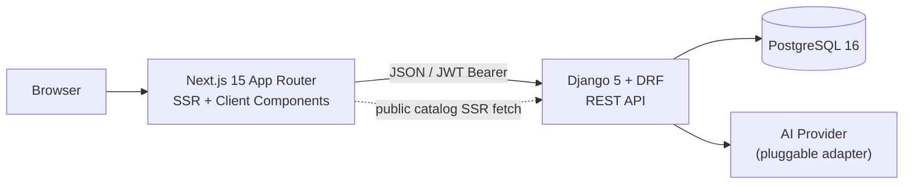

# Software Requirements Specification — Souqi Platform

**Version:** SRS v1.0 (corresponds to MVP v1.0)
**Base Reference:** PRD + Execution Blueprint — Souqi Platform
**Stack:** Django 5.x + Django REST Framework · Next.js 15 (App Router) · PostgreSQL 16
**Status:** Approved for implementation

---

## 1. Introduction

### 1.1 Purpose

This document transforms the PRD into **implementable and testable requirements**, tied to a specific stack. Each requirement carries an identifier (`FR-xx` / `NFR-xx` / `DR-xx`) and a reference to the PRD.

The PRD answers "why and what". This document answers "exactly how, and how we prove it works".

### 1.2 Scope

Multi-vendor e-commerce system, MVP, covering:
`Discover → Product → Cart → Checkout → Order → Inventory → Seller Fulfillment → Admin Visibility` + AI seller assistant.

**Out of Scope:** Everything in PRD §4.2 (no real payments, no shipping, no commissions, no mobile native).

### 1.3 Definitions

| Term | Definition |
|---|---|
| Idempotency Key | UUID generated by the client (Frontend) for each logical Checkout attempt |
| Snapshot | Copy of product transaction data saved in `OrderItem` at order time |
| Authoritative Price | Price read from the `Product` table on the server at Checkout moment |
| Actor | Role executing the operation: Guest / Customer / Seller / Admin |

### 1.4 References

* PRD — Souqi Platform MVP v1.0 (all references to `F0x`, `US-x`, `ECx`, `ODx` trace back to it)
* Django 5.x docs, DRF 3.15, `djangorestframework-simplejwt`
* Next.js App Router docs

---

## 2. Overall Description

### 2.1 System Architecture



**Architectural Decisions:**

| # | Decision | Rationale |
|---|---|---|
| AD-01 | Django/DRF as separate API (no Django Templates) | Independent frontend, one interface serves any future client |
| AD-02 | JWT via `simplejwt` (access 15m + refresh 7d) | Stateless, suitable for frontend separated from backend domain |
| AD-03 | Refresh token in `httpOnly` cookie, access in memory | Prevents XSS from stealing refresh token |
| AD-04 | All critical business rules enforced at DB constraint level first | Database constraints cannot be bypassed from any code path |
| AD-05 | Catalog pages: Server Components + `fetch` with `revalidate` | SEO + initial speed without complexity |
| AD-06 | Cart/Checkout/Dashboard: Client Components + authenticated fetch | User-specific data, no cache |
| AD-07 | AI behind abstract `AIProvider` interface (single protocol) | Swap provider without touching business logic (OD08) |

### 2.2 Actors & Permissions

| Capability | Guest | Customer | Seller | Admin |
|---|:-:|:-:|:-:|:-:|
| Browse / View Product | ✅ | ✅ | ✅ | ✅ |
| Add to Cart / Checkout | ❌ | ✅ | ❌ | ❌ |
| Product CRUD (own) | ❌ | ❌ | ✅ | ✅ (any) |
| Manage Stock (own) | ❌ | ❌ | ✅ | ✅ |
| View own orders | ❌ | ✅ | ✅ (seller-scoped) | ✅ (all) |
| Update order status | ❌ | ❌ (cancel only) | ✅ (own orders) | ✅ |
| Moderate products / Manage users | ❌ | ❌ | ❌ | ✅ |
| Request AI suggestion | ❌ | ❌ | ✅ | ✅ |

> **Approved Decision:** Seller and Admin do not purchase in MVP (was "Optional" in PRD). Reduces test cases and doesn't lose demo value.

### 2.3 Assumptions & Dependencies

* PostgreSQL available with transaction and `SELECT ... FOR UPDATE` support (requirement for FR-27).
* AI provider may fail or delay — system must remain fully functional without it (NFR-09).
* No background workers in MVP; all operations synchronous.

---

## 3. Functional Requirements

Priority: **M** = Must (P0), **S** = Should (P1).

### 3.1 Authentication & Accounts

| ID | Requirement | Pri | Trace |
|---|---|:-:|---|
| FR-01 | User registers with `email` + `password` + `name`, and chooses `customer` or `seller` role at registration. | M | OD01 |
| FR-02 | System issues `access` + `refresh` token upon successful login. | M | OD01 |
| FR-03 | System rejects any operation requiring authentication with `401` when access token is missing/expired. | M | §16 |
| FR-04 | When choosing `seller` role, `SellerProfile` is created automatically with `active` status. | M | F07 |
| FR-05 | Password is stored hashed via Django default `PBKDF2`; never returned in any response. | M | §16 |
| FR-06 | `email` is unique system-wide (case-insensitive). | M | DR-01 |

### 3.2 Product Discovery — F01 / US-C01

| ID | Requirement | Pri | Trace |
|---|---|:-:|---|
| FR-07 | `GET /api/products/` displays only products with `status = published`, for any visitor. | M | F01 |
| FR-08 | Each item contains: `id, name, price, primary_image, stock_state, seller_name, category`. | M | F01 |
| FR-09 | `stock_state` is a server-computed value: `out_of_stock` if `stock_quantity = 0`, `low_stock` if `1..LOW_STOCK_THRESHOLD` (default 5), otherwise `available`. | M | F01 |
| FR-10 | Text search via `?search=` on `name` and `description` (PostgreSQL `ILIKE`). | M | F01 |
| FR-11 | Filtering via `?category=<id>` and `?seller=<id>`, ordering via `?ordering=price,-created_at`. | M | F01 |
| FR-12 | Pagination with page size 20 (`page`, `page_size` capped at 100). | M | NFR-01 |
| FR-13 | Products `draft`, `rejected`, or `archived` do not appear in any public endpoint or search results. | M | AC §10 |

> **Implementation Note:** `ILIKE` is sufficient for MVP size. Upgrade to `SearchVector`/GIN when exceeding ~10k products. `# ponytail: ILIKE scan, upgrade to GIN full-text if catalog grows`

### 3.3 Product Details — F02 / US-C02

| ID | Requirement | Pri | Trace |
|---|---|:-:|---|
| FR-14 | `GET /api/products/<id>/` returns full details + image list ordered by `sort_order` + seller public info. | M | F02 |
| FR-15 | Returns `404` for unpublished product when requested by non-owner or non-Admin. | M | §16 IDOR |
| FR-16 | Returns actual `available_quantity` when `stock_quantity <= LOW_STOCK_THRESHOLD`, otherwise just `stock_state`. | M | F02 |

### 3.4 Cart — F03 / US-C03, US-C04

| ID | Requirement | Pri | Trace |
|---|---|:-:|---|
| FR-17 | One active cart per Customer (`OneToOne`), created on first add. **No guest cart.** | M | OD02 |
| FR-18 | `POST /api/cart/items/` with `{product_id, quantity}`. If product exists in cart, quantity is replaced with new value (replace semantics, not add). | M | F03 |
| FR-19 | Rejects `quantity < 1` with `400`. | M | AC §10 |
| FR-20 | Rejects `quantity > stock_quantity` with `400` and `{code: "insufficient_stock"}`. `available: N` is included **only** when `stock_quantity <= LOW_STOCK_THRESHOLD` — above the threshold exact stock stays hidden (FR-16), otherwise any caller could read it back by requesting an absurd quantity. Cart = `400`; the same shortfall found under lock at checkout = `409` (FR-37). | M | EC01 |
| FR-21 | Rejects adding unpublished product with `400`. | M | F03 |
| FR-22 | **Single-seller cart:** Adding product from different seller than cart contents rejects with `409 {code: "multi_seller_cart"}` with option to clear cart. | M | OD04 |
| FR-23 | `PATCH /api/cart/items/<id>/` to modify quantity, `DELETE` to remove, `DELETE /api/cart/` to clear. | M | F03 |
| FR-24 | `GET /api/cart/` returns per line: current `unit_price`, `line_total`, `stock_state`, and `issues[]` list. `subtotal` computed on server. | M | F03 |
| FR-25 | **Cart revalidation:** Each cart read re-validates: product exists, `published` status, quantity available, price change since add. Any fault shows as explicit `issue` and blocks Checkout. | M | EC03, EC07 |
| FR-26 | Price change after add: server's current price is used, `price_changed` issue shown with `old_price`/`new_price`, client must acknowledge before Checkout. The acknowledgement carries the **product id and the exact price the customer saw** (`{code, product_id, new_price}`), and is re-matched against the locked row at checkout. A bare `"price_changed"` code is rejected — it would clear an issue raised by a *second* price move the customer never saw. Drift detected via `CartItem.unit_price_at_add` (§4.6). | M | OD05, EC07 |

### 3.5 Checkout & Order Creation — F04, F05 / US-C05

| ID | Requirement | Pri | Trace |
|---|---|:-:|---|
| FR-27 | `POST /api/checkout/` executes entire operation inside `transaction.atomic()` with `select_for_update()` on relevant product rows, ordered by `product_id` ascending to avoid deadlock. | M | §11.1, R2 |
| FR-28 | Checkout sequence mandatory: `verify idempotency → lock products → verify published → verify quantities → compute totals → create Order + OrderItems → deduct stock → create OrderStatusHistory → clear cart → commit`. | M | §11.1 |
| FR-29 | Any step fails ⇒ full transaction rollback. No partial Order, no stock deduction. | M | EC06, AC §10 |
| FR-30 | **Server recomputes everything.** Any `price` / `total` / `line_total` from client is completely ignored (not even read from request). | M | §11.3, §16 |
| FR-31 | `order_total = subtotal = SUM(unit_price × quantity)`. No shipping, no taxes, no discounts in MVP. | M | OD09, §11.3 |
| FR-32 | **Idempotency:** Request requires `Idempotency-Key: <uuid4>` header. Missing ⇒ `400`. Duplicate key ⇒ same previous Order returned with `200` instead of new order. | M | §11.8, EC05 |
| FR-33 | Stored in each `OrderItem`: `product_name_snapshot`, `unit_price_snapshot`, `quantity`, `line_total`. Later product edits don't change historical orders. | M | §11.4 |
| FR-34 | Initial order status `pending`, one row logged in `OrderStatusHistory` with `from_status = null`. | M | §11.5 |
| FR-35 | Delivery data mandatory: `contact_name`, `contact_phone`, `delivery_address`, stored on Order as text snapshot. | M | F04 |
| FR-36 | Checkout with empty cart ⇒ `400 {code: "empty_cart"}`. | M | F04 |
| FR-37 | Checkout with cart containing any unacknowledged `issue` ⇒ `409` with issues list. | M | EC03 |
| FR-38 | Success response: `{order_number, status, items[], subtotal, total, created_at}` with `201`. | M | F05 |

### 3.6 Inventory — F06 / US-S03

| ID | Requirement | Pri | Trace |
|---|---|:-:|---|
| FR-39 | `stock_quantity` cannot be negative — guaranteed by `CheckConstraint` at PostgreSQL level. | M | AC §10, DR-05 |
| FR-40 | Deduction happens once per Order only, via `F('stock_quantity') - qty` inside transaction. | M | §11.1 |
| FR-41 | `stock_quantity` reaching 0 makes product automatically non-purchasable (`stock_state = out_of_stock`), without changing `status`. | M | F06 |
| FR-42 | Order cancellation (`cancelled`) restores quantities to stock inside single transaction, once only (guarded by `stock_restored` boolean on Order). | M | §11.5 |
| FR-43 | `PATCH /api/seller/products/<id>/` allows seller to update `stock_quantity` with value `>= 0` only. | M | US-S03 |

### 3.7 Order Lifecycle & Tracking — US-C06, US-S05

| ID | Requirement | Pri | Trace |
|---|---|:-:|---|
| FR-44 | Approved statuses: `pending, confirmed, preparing, ready, completed, cancelled`. | M | OD03 |
| FR-45 | Only allowed transitions are those in §6.1. Any other transition ⇒ `400 {code: "invalid_transition"}`. | M | §11.5 |
| FR-46 | Each successful transition creates row in `OrderStatusHistory` with `from_status, to_status, changed_by, created_at`. | M | §11.5 |
| FR-47 | `GET /api/orders/` returns only current user's orders. `GET /api/orders/<id>/` returns `404` for another user's order (not `403`, to avoid existence leak). | M | EC04, §16 |
| FR-48 | Customer sees current status + complete timeline from `OrderStatusHistory`. | M | US-C06 |

### 3.8 Seller Workflow — F07

| ID | Requirement | Pri | Trace |
|---|---|:-:|---|
| FR-49 | `POST /api/seller/products/` creates product with `draft` status; seller publishes explicitly via `POST .../publish/`. Publishing requires **at least one image**; a product with no images, or with status `rejected`/`archived`, is rejected with `400`. | M | OD07 |
| FR-50 | Seller can read/edit/delete only their products. Queryset filtered by `seller=request.user.sellerprofile` — no reliance on single view check. | M | §11.7, EC04 |
| FR-51 | Deletion is soft delete (`status = archived`); product linked to orders is never actually deleted. | M | §11.4 |
| FR-52 | `GET /api/seller/orders/` returns orders for this seller's products only, without customer personal data except `contact_name`, `contact_phone`, `delivery_address`. | M | F07, §16 |
| FR-53 | `POST /api/seller/orders/<id>/transition/` with `{to_status}` — constrained by table §6.1. | M | US-S05 |
| FR-54 | `GET /api/seller/dashboard/` returns: product count, out-of-stock products, low-stock products, orders per status. | M | F07 |
| FR-55 | Product image upload (up to 5 images, ≤2MB each, `jpeg/png/webp` only) via `POST /api/seller/products/<id>/images/`. | M | F02 |

### 3.9 Admin — F08

| ID | Requirement | Pri | Trace |
|---|---|:-:|---|
| FR-56 | `GET /api/admin/metrics/` returns: total orders, total sales, published product count, active seller count, orders by status. | S | F08 |
| FR-57 | Admin reads and edits any product, can transition to `rejected` with mandatory `moderation_note`. | S | F08 |
| FR-58 | `GET /api/admin/orders/` returns all orders with filtering by status/seller/date. | S | US-A02 |
| FR-59 | Admin can disable user (`status = suspended`); disabled user fails login and products are hidden from catalog. When the user's role is `seller`, the same operation mirrors `status` onto their `SellerProfile` in the same transaction — that field has no endpoint of its own. | S | F08 |
| FR-60 | Built-in Django Admin used as backup admin interface only, not counted as implementation of FR-56..59. | S | — |

> **ponytail:** `# ponytail: admin metrics = live COUNT/SUM queries; add materialized view if orders exceed ~100k`

### 3.10 AI Features — F09

| ID | Requirement | Pri | Trace |
|---|---|:-:|---|
| FR-61 | `POST /api/ai/suggest-description/` with `{name, category_id, attributes, notes}` returns schema in §7.1. Available to Seller/Admin only. | S | §12.1 |
| FR-62 | `POST /api/ai/suggest-tags/` with `{title, description}` returns schema in §7.2. | S | §12.2 |
| FR-63 | `POST /api/ai/moderate/` returns list of review notes on product (`missing_info`, `suspicious_claims`, `inappropriate_terms`). | S | §12.3 |
| FR-64 | Each AI output that passes validation is stored in `AIContentSuggestion` with `review_status = pending` and never auto-applied to product. Outputs failing validation take the `rejected` path in FR-65. | S | §12.5, US-A03 |
| FR-65 | AI output fails schema validation or `confidence < 0.5` ⇒ `review_status = rejected` and returned to client as `{status: "needs_regeneration"}`. Not shown as valid suggestion. | S | §12.5 |
| FR-66 | Suggestion application done by explicit human action: `POST /api/ai/suggestions/<id>/accept/` — writes values to product and sets `review_status = accepted` and `reviewed_by`. Which values, per `suggestion_type`: `description` ⇒ `title → Product.name`, `description → Product.description`; `tags` ⇒ `category → Product.category` only when it matches an existing `Category.name` (AI-07); `moderation` ⇒ **not acceptable**, advisory only, `400`. Fields with no MVP home (`short_description`, `highlights`, `suggested_tags`, `tags`) are not stored — there is no `Tag` entity. | S | US-A03 |
| FR-67 | AI **never called** in paths: price calculation, inventory, order total, permissions, ownership, state transitions. | M | §12.4 |
| FR-68 | Rate limit: 10 AI requests per **user** per hour. Keyed on `user_id`, not seller profile — FR-61 grants AI access to Admin too, and Admin has no `SellerProfile`. | S | NFR-08 |
| FR-69 | AI provider failure/timeout (>10s) ⇒ `503 {code: "ai_unavailable"}` without affecting any other function. | S | NFR-09 |

### 3.11 Frontend Requirements (Next.js)

| ID | Requirement | Pri | Trace |
|---|---|:-:|---|
| FR-70 | Pages: `/` (catalog), `/products/[id]`, `/cart`, `/checkout`, `/orders`, `/orders/[id]`, `/seller/*`, `/admin/*`, `/login`, `/register`. | M | §13 |
| FR-71 | Each list/data page implements three states explicitly: **Loading** (skeleton), **Empty** (clear message), **Error** (message + Retry). | M | §13.1 |
| FR-72 | `Add to Cart` button `disabled` when `stock_state = out_of_stock`, with alternate text "Currently unavailable". | M | §13.2 |
| FR-73 | Show "Only N left" when `low_stock`. | M | §13.1 |
| FR-74 | Checkout page displays complete summary (items, quantities, prices, total) before confirmation, total shown is from server. | M | §13.4 |
| FR-75 | Confirm Order button disabled immediately on click until response arrives, sends same `Idempotency-Key` on retry. | M | EC05 |
| FR-76 | Order tracking page displays all six statuses in a progress bar with current status highlighted. | M | §13.6 |
| FR-77 | Next.js Middleware protects `/seller/*`, `/admin/*`, `/cart`, `/checkout`, `/orders` — but this is **UX only**, real protection in API (FR-03, FR-50). | M | §11.6 |
| FR-78 | Each API error translated to clear English message via `error.code → message` map. | M | §13.3 |

### 3.12 Testing & Deployment — F10

| ID | Requirement | Pri | Trace |
|---|---|:-:|---|
| FR-79 | Command `python manage.py seed_demo` creates: 3 sellers, 12 products, 4 categories, 2 customers, admin, with varied stock states (one at 5, one at 0). Each seeded product gets **at least one image** — publishing requires it (FR-49), so an image-less seed cannot produce a published catalog. | M | F10 |
| FR-80 | Test coverage mandatory per matrix §9. | M | F10 |
| FR-81 | Docker Compose with three services: `db` (postgres:16), `api` (django + gunicorn), `web` (next). | M | F10 |

---

## 4. Data Requirements (Django Models)

Each table below is a Django model. `id` = `BigAutoField` unless stated otherwise, and `created_at`/`updated_at` = `auto_now_add`/`auto_now`.

### 4.1 `accounts.User` (Custom AbstractUser)

| Field | Type | Constraints |
|---|---|---|
| `email` | `EmailField` | `unique=True`, `db_index`, used as `USERNAME_FIELD` |
| `name` | `CharField(120)` | required |
| `role` | `CharField(16, choices)` | `customer` \| `seller` \| `admin` |
| `status` | `CharField(16, choices)` | `active` \| `suspended`, default `active` |

**DR-01:** `UniqueConstraint(Lower('email'), name='uniq_email_ci')`

### 4.2 `accounts.SellerProfile`

| Field | Type | Constraints |
|---|---|---|
| `user` | `OneToOneField(User, CASCADE)` | — |
| `business_name` | `CharField(120)` | required |
| `description` | `TextField(blank=True)` | — |
| `status` | `CharField(16)` | `active` \| `suspended` |

### 4.3 `catalog.Category`

`name CharField(80) unique` · `slug SlugField unique` · `status CharField(16)` (`active`/`hidden`)

### 4.4 `catalog.Product`

| Field | Type | Constraints |
|---|---|---|
| `seller` | `FK(SellerProfile, PROTECT, related_name='products')` | — |
| `category` | `FK(Category, PROTECT, null=True)` | — |
| `name` | `CharField(160)` | required |
| `description` | `TextField` | max 5000 |
| `price` | `DecimalField(10, 2)` | — |
| `stock_quantity` | `PositiveIntegerField` | default 0 |
| `status` | `CharField(16, choices)` | `draft` \| `published` \| `rejected` \| `archived` |
| `moderation_note` | `TextField(blank=True)` | mandatory logically when `rejected` |

**DR-02:** `CheckConstraint(price >= 0, name='product_price_non_negative')`
**DR-03:** `CheckConstraint(stock_quantity >= 0, name='product_stock_non_negative')`
**DR-04:** `Index(fields=['status', '-created_at'])` — serves sorted catalog
**DR-05:** `PROTECT` on `seller` prevents deletion of seller with products (safety for FR-51)

### 4.5 `catalog.ProductImage`

`product FK(Product, CASCADE)` · `image ImageField(upload_to='products/')` · `sort_order PositiveSmallIntegerField default 0`
**DR-06:** `UniqueConstraint(product, sort_order)`

### 4.6 `orders.Cart` / `orders.CartItem`

**Cart:** `customer OneToOneField(User, CASCADE)`
**CartItem:** `cart FK(Cart, CASCADE)` · `product FK(Product, CASCADE)` · `quantity PositiveIntegerField` · `unit_price_at_add DecimalField(10,2)`

`unit_price_at_add` is written on every add/update and exists **solely** to detect price drift for FR-25/26 — without it `price_changed` cannot be computed at all. It is never a source of truth for money: totals always come from `Product.price` under lock (FR-30).

**DR-07:** `UniqueConstraint(cart, product, name='uniq_cart_product')` — makes FR-18 structurally correct
**DR-08:** `CheckConstraint(quantity >= 1, name='cartitem_qty_min')`

### 4.7 `orders.Order`

| Field | Type | Constraints |
|---|---|---|
| `order_number` | `CharField(20)` | `unique`, format `SQ-{YYYY}-{seq}` |
| `customer` | `FK(User, PROTECT)` | — |
| `seller` | `FK(SellerProfile, PROTECT)` | derived from cart (OD04) |
| `status` | `CharField(16, choices)` | default `pending` |
| `subtotal` | `DecimalField(12,2)` | — |
| `total` | `DecimalField(12,2)` | = `subtotal` in MVP |
| `contact_name` / `contact_phone` / `delivery_address` | `CharField/TextField` | snapshot |
| `idempotency_key` | `UUIDField` | — |
| `stock_restored` | `BooleanField` | default `False` |

**DR-09:** `UniqueConstraint(customer, idempotency_key, name='uniq_checkout_idempotency')` — **this is the actual implementation of EC05.** Duplicate insert raises `IntegrityError` translated to return original order.
**DR-10:** `CheckConstraint(subtotal >= 0 AND total >= 0)`

### 4.8 `orders.OrderItem`

| Field | Type |
|---|---|
| `order` | `FK(Order, CASCADE, related_name='items')` |
| `product` | `FK(Product, PROTECT)` |
| `product_name_snapshot` | `CharField(160)` |
| `unit_price_snapshot` | `DecimalField(10,2)` |
| `quantity` | `PositiveIntegerField` |
| `line_total` | `DecimalField(12,2)` |

**DR-11:** `CheckConstraint(quantity >= 1)`
**DR-12:** `CheckConstraint(line_total = unit_price_snapshot * quantity)` — makes §11.3 unbreakable even from shell.
**DR-13:** `PROTECT` on `product` — product sold once is never deleted.

### 4.9 `orders.OrderStatusHistory`

`order FK(Order, CASCADE)` · `from_status CharField(16, null=True)` · `to_status CharField(16)` · `changed_by FK(User, SET_NULL, null=True)` · `created_at`

### 4.10 `ai.AIContentSuggestion`

| Field | Type |
|---|---|
| `target_type` | `CharField(32)` — `product` in MVP |
| `target_id` | `BigIntegerField(null=True)` — null for pre-created product |
| `suggestion_type` | `CharField(32)` — `description` \| `tags` \| `moderation` |
| `input_payload` | `JSONField` |
| `structured_output` | `JSONField` |
| `confidence` | `DecimalField(3,2)` |
| `review_status` | `CharField(16)` — `pending` \| `accepted` \| `rejected` |
| `reviewed_by` | `FK(User, SET_NULL, null=True)` |
| `requested_by` | `FK(User, PROTECT)` |

**DR-14:** `CheckConstraint(confidence >= 0 AND confidence <= 1)`

---

## 5. API Specification

Base: `/api/`. All responses JSON. Errors in standard format:

```json
{ "error": { "code": "insufficient_stock", "message": "…", "details": {} } }
```

### 5.1 Auth

| Method | Path | Role | Body → Response |
|---|---|---|---|
| POST | `/auth/register/` | Guest | `{email,password,name,role}` → `201 {user, access, refresh}` |
| POST | `/auth/login/` | Guest | `{email,password}` → `200 {user, access, refresh}` |
| POST | `/auth/refresh/` | Guest | `{refresh}` → `200 {access}` |
| GET | `/auth/me/` | Auth | → `200 {id,name,email,role}` |

### 5.2 Catalog (public)

| Method | Path | Role | Notes |
|---|---|---|---|
| GET | `/products/` | Any | `?search&category&seller&ordering&page` |
| GET | `/products/<id>/` | Any | `404` for unpublished |
| GET | `/categories/` | Any | `status=active` only |

### 5.3 Cart (Customer)

| Method | Path | Errors |
|---|---|---|
| GET | `/cart/` | — |
| POST | `/cart/items/` | `400 invalid_quantity` · `400 insufficient_stock` · `400 product_not_purchasable` · `409 multi_seller_cart` |
| PATCH | `/cart/items/<id>/` | as above · `404` for item not in user's cart |
| DELETE | `/cart/items/<id>/` | `404` |
| DELETE | `/cart/` | — |

### 5.4 Checkout & Orders (Customer)

| Method | Path | Notes |
|---|---|---|
| POST | `/checkout/` | `Idempotency-Key` header mandatory. `201` new · `200` duplicate · `400 empty_cart` · `409 cart_has_issues` · `409 insufficient_stock` |
| GET | `/orders/` | current user's orders only |
| GET | `/orders/<id>/` | `404` for other user's order |
| POST | `/orders/<id>/cancel/` | allowed only from `pending`/`confirmed` |

### 5.5 Seller

| Method | Path |
|---|---|
| GET/POST | `/seller/products/` |
| GET/PATCH/DELETE | `/seller/products/<id>/` |
| POST | `/seller/products/<id>/publish/` |
| POST/DELETE | `/seller/products/<id>/images/` |
| GET | `/seller/orders/` · `?status=` |
| GET | `/seller/orders/<id>/` |
| POST | `/seller/orders/<id>/transition/` → `{to_status}` |
| GET | `/seller/dashboard/` |

### 5.6 Admin

`GET /admin/metrics/` · `GET/PATCH /admin/products/<id>/` · `GET /admin/orders/` · `GET/PATCH /admin/users/<id>/` · `GET /admin/ai-suggestions/`

### 5.7 AI

`POST /ai/suggest-description/` · `POST /ai/suggest-tags/` · `POST /ai/moderate/` · `POST /ai/suggestions/<id>/accept/` · `POST /ai/suggestions/<id>/reject/`

### 5.8 HTTP Status Contract

| Code | When |
|---|---|
| 400 | Input validation error or user-fixable business rule |
| 401 | No authentication / token expired |
| 403 | Authenticated but insufficient role (not used for ownership breach) |
| 404 | Resource not found **or** not owned by this user (prevents existence leak) |
| 409 | State conflict: multi-seller cart, unacknowledged issues, stock changed during checkout |
| 503 | AI provider unavailable |

---

## 6. Business Rules as Requirements

### 6.1 Order State Machine

| From → To | Customer | Seller (order owner) | Admin |
|---|:-:|:-:|:-:|
| `pending → confirmed` | ❌ | ✅ | ✅ |
| `pending → cancelled` | ✅ | ✅ | ✅ |
| `confirmed → preparing` | ❌ | ✅ | ✅ |
| `confirmed → cancelled` | ✅ | ✅ | ✅ |
| `preparing → ready` | ❌ | ✅ | ✅ |
| `ready → completed` | ❌ | ✅ | ✅ |
| `* → cancelled` from `preparing`/`ready` | ❌ | ✅ | ✅ |
| from `completed` or `cancelled` | ❌ | ❌ | ❌ (terminal) |

**BR-01:** Above table implemented as single `dict` `ALLOWED_TRANSITIONS: {(from, to): {roles}}` in one module, called by seller endpoint, customer cancel, and admin. No multiple logic copies.
**BR-02:** Any transition to `cancelled` from non-terminal status triggers stock restoration (FR-42) inside same transaction.
**BR-03:** `completed` and `cancelled` are terminal states — no exit from them ever.

### 6.2 Atomic Checkout — Mandatory Implementation

```python
# ponytail: row-level locks, sufficient at MVP scale; revisit if checkout throughput becomes a bottleneck
with transaction.atomic():
    existing = Order.objects.filter(customer=user, idempotency_key=key).first()
    if existing:
        return existing                       # FR-32

    items = cart.items.select_related('product').order_by('product_id')
    products = Product.objects.select_for_update().filter(
        id__in=[i.product_id for i in items]
    ).order_by('id')                          # FR-27: ordered locking, no deadlock

    for item in items:
        validate_publishable(product)         # FR-21
        validate_stock(product, item.quantity)  # FR-20 / EC01 → raise → rollback

    subtotal = sum(p.price * i.quantity)      # FR-30: server-side only
    order = Order.objects.create(...)
    OrderItem.objects.bulk_create(snapshots)  # FR-33
    Product.objects.filter(id=pid).update(
        stock_quantity=F('stock_quantity') - qty
    )                                          # FR-40, guarded by DR-03
    OrderStatusHistory.objects.create(from_status=None, to_status='pending')
    cart.items.all().delete()
```

**BR-04:** `select_for_update()` ordered by `id` prevents deadlock between concurrent checkouts on same products.
**BR-05:** `DR-03` is last defense: even if code errs, PostgreSQL rejects negative stock and drops transaction.
**BR-06:** `DR-09` is last defense against duplicate order: race between two requests with same key ⇒ one raises `IntegrityError` ⇒ return original order.

### 6.3 Ownership Enforcement

**BR-07:** Each seller/customer endpoint builds queryset filtered by owner **before** any `get_object()`. Ownership is not a post-fetch check, but a fetch condition.
**BR-08:** Never use `Product.objects.get(pk=...)` directly in any seller view — use `self.get_queryset()` filtered.

---

## 7. AI Contracts

### 7.1 Description Suggestion — Response Schema

```json
{
  "title": "string",
  "short_description": "string",
  "description": "string",
  "highlights": ["string"],
  "suggested_tags": ["string"],
  "confidence": 0.0
}
```

**Validation (AI-01..06):**

| ID | Rule |
|---|---|
| AI-01 | Valid JSON matching schema, else `rejected` |
| AI-02 | `title` 3–160 chars · `short_description` ≤ 300 · `description` 20–5000 |
| AI-03 | `highlights` 1–6 items, each ≤ 120 chars |
| AI-04 | `suggested_tags` 0–10, each `^[\w\s-]{2,30}$` |
| AI-05 | `0.0 ≤ confidence ≤ 1.0`; below 0.5 ⇒ `needs_regeneration` (FR-65) |
| AI-06 | All text passed through HTML escaping before storage and display — **AI output = untrusted input** |

### 7.2 Tag/Category Suggestion — Response Schema

```json
{ "category": "string", "tags": ["string"], "confidence": 0.0 }
```

**AI-07:** `category` must match existing `Category.name`; otherwise field ignored and no new category invented.

### 7.3 Review Workflow

```
Seller requests → AIContentSuggestion(pending) → Seller previews
   ├─ accept → values written to Product (still `draft`) → review_status=accepted
   └─ reject → review_status=rejected → optional regenerate
```

**AI-08:** No code path makes `Product.status = published` as direct result of AI call. Publishing is separate human action (FR-49).

---

## 8. Non-Functional Requirements

| ID | Requirement |
|---|---|
| NFR-01 | `GET /products/` responds within ≤500ms (p95) for 1000 products, with pagination and `select_related`/`prefetch_related` — no N+1. |
| NFR-02 | `POST /checkout/` responds within ≤2s (p95). Correctness before speed. |
| NFR-03 | No Order or stock edit left partial after any failure (guaranteed by `transaction.atomic`). |
| NFR-04 | Each list query uses appropriate index (DR-04). |
| NFR-05 | Structured logging (JSON) for: checkout failure, unauthorized access, stock validation failure, invalid transition, AI failure — with fields `event, user_id, resource_id, reason`. |
| NFR-06 | Health endpoint `GET /api/health/` checks DB connection. |
| NFR-07 | General rate limit: 100 req/min per authenticated user, 30 req/min per unauthenticated IP (DRF throttling). **The public catalog (`/products/`, `/categories/`, `/health/`) is exempt from the anonymous throttle.** AD-05 makes catalog pages a server-side Next.js `fetch`, so every public request reaches Django from one origin IP — a 30/min IP throttle would cap the entire site's browsing traffic at 30 req/min. Protect those routes with per-client-IP limits derived from a trusted forwarded header, or at the edge, not with `AnonRateThrottle`. |
| NFR-08 | AI-specific rate limit: 10/hour per user (FR-68). |
| NFR-09 | AI provider failure doesn't break any P0 function. |
| NFR-10 | Design assumes no fixed seller/product count; no hardcoded limits in code. |
| NFR-11 | All user-facing text in frontend in English, API codes in English. |
| NFR-12 | Text direction set explicitly at layout level (`<html lang="en" dir="ltr">`) rather than left to the browser default, so a future locale change is a one-attribute edit. No RTL layout work in MVP. |

---

## 9. Security Requirements

| ID | Requirement | Trace |
|---|---|---|
| SEC-01 | Every endpoint defines `permission_classes` explicitly. Project default `IsAuthenticated`; public endpoints opt-out explicitly. | §16 |
| SEC-02 | **IDOR:** Changing `id` in path grants no access to another user's resource — implemented via queryset filtering (BR-07), tested in §9 matrix. | §16 |
| SEC-03 | Any financially sensitive field (`price`, `total`, `subtotal`, `line_total`) absent from all serializer inputs — always read-only. | FR-30 |
| SEC-04 | Validation on: `quantity` (int ≥1), `id` (positive int), text lengths, enum values. | §16 |
| SEC-05 | Passwords: minimum 8 chars + Django default validators. Never logged. | FR-05 |
| SEC-06 | CORS restricted to frontend origin only. `CSRF_TRUSTED_ORIGINS` configured. | — |
| SEC-07 | Image upload: check actual MIME (not just extension), 2MB limit, storage outside executable path. | FR-55 |
| SEC-08 | `DEBUG=False` in production, `SECRET_KEY` from env var, `ALLOWED_HOSTS` explicit. | — |
| SEC-09 | AI outputs treated as untrusted input: schema validation + escaping + human review. | AI-06 |
| SEC-10 | `suspended` user denied login and current tokens rejected (status checked on every authenticated request). | FR-59 |

---

## 10. Testing Requirements

### 10.1 Mandatory Test Matrix

| Test ID | Type | Scenario | Expected Result | Trace |
|---|---|---|---|---|
| T-01 | Unit | `subtotal` for 3 different lines | equals `unit_price × qty` sum with Decimal precision | §11.3 |
| T-02 | Unit | Each transition in table §6.1 | allowed only for specified roles | §11.5 |
| T-03 | Unit | `completed → preparing` transition | `400 invalid_transition` | BR-03 |
| T-04 | Unit | `stock_state` at 0 / 3 / 50 | `out_of_stock` / `low_stock` / `available` | FR-09 |
| T-05 | Integration | Add product to cart with valid qty | `201` + one line in cart | FR-18 |
| T-06 | Integration | Add same product again with qty 3 | one line with qty 3 (replace) | FR-18, DR-07 |
| T-07 | Integration | Add product from different seller | `409 multi_seller_cart` | FR-22 |
| T-08 | Integration | Successful checkout: stock 5, qty 2 | Order + stock = 3 | Demo |
| T-09a | Integration | **EC01** cart: add qty 4, stock 3 | `400 insufficient_stock`, line not written (FR-20) | EC01 |
| T-09b | Integration | **EC01** checkout: stock drops to 3 after a qty-4 line was written | `409 insufficient_stock`, no Order, stock stays 3 (FR-37) | EC01 |
| T-10 | Integration | **EC02** buy product stock = 0 | rejected in cart (`400`) and checkout (`409`) | EC02 |
| T-11 | Integration | **EC03** edit stock to 1 after adding 2 to cart | `GET /cart/` shows issue, checkout `409` | EC03 |
| T-12 | Integration | **EC05** call checkout twice with same `Idempotency-Key` | one Order only, second `200` with same `order_number` | EC05, DR-09 |
| T-13 | Integration | **EC06** inject failure after verify, before commit | no Order, stock unchanged | EC06 |
| T-14 | Integration | **EC07** edit price 20→25 after add | cart shows `price_changed`, order computed at 25 after ack | EC07, OD05 |
| T-15 | Integration | Buy full quantity (stock 5, qty 5) | success, stock = 0, product `out_of_stock` | FR-41 |
| T-16 | Integration | Cancel `pending` order | stock returns, `stock_restored = True` | FR-42 |
| T-17 | Integration | Cancel same order twice | second `400`, stock not doubled | FR-42 |
| T-18 | Security | **EC04** Seller A edits Seller B product | `404` | FR-50 |
| T-19 | Security | Customer A opens Customer B order | `404` | FR-47 |
| T-20 | Security | checkout without token | `401` | FR-03 |
| T-21 | Security | Customer calls `/seller/products/` | `403` | SEC-01 |
| T-22 | Security | Send `price` or `total` in checkout body | completely ignored; total computed from DB | SEC-03 |
| T-23 | Security | `GET /products/<id>` for `draft` product by other user | `404` | FR-15 |
| T-24 | Security | `suspended` user attempts any operation | `401`/`403` | SEC-10 |
| T-25 | Unit (AI) | AI output with invalid JSON | `rejected`, not shown | AI-01 |
| T-26 | Unit (AI) | `confidence = 0.3` | `needs_regeneration` | FR-65 |
| T-27 | Integration (AI) | Accept suggestion | values written, product stays `draft` | AI-08 |
| T-28 | Integration (AI) | AI provider times out | `503`, no side effect | FR-69 |
| T-29 | E2E | Full demo scenario (§11) | all nine steps succeed | R5 |
| T-30 | Concurrency | Two concurrent checkouts on product stock = 1 | one succeeds, other `409`, stock = 0 not -1 | BR-04, DR-03 |

### 10.2 Test Acceptance Criteria

* T-01..T-30 all green required for Definition of Done (T-09 counts as two cases, T-09a and T-09b — both required).
* T-09..T-14 and T-18..T-24 and T-30 **must not be disabled or skipped** under any circumstance.
* Tests run on real PostgreSQL (not SQLite) — `select_for_update` and `CheckConstraint` not truly tested on SQLite.

---

## 11. Demo Acceptance Scenario (E2E — T-29)

| # | Action | Verification |
|---|---|---|
| 1 | Seller creates "Natural Lavender Soap" — 25, stock 5 — and publishes | appears in `GET /products/` |
| 2 | Customer opens product | `stock_state = available`, price 25 |
| 3 | Adds qty 2 | Cart: `line_total = 50`, `subtotal = 50` |
| 4 | Checkout with Idempotency-Key | `201`, `SQ-2026-1001`, `status=pending`, `total=50` |
| 5 | Check product | `stock_quantity = 3` |
| 6 | Seller sees order and transitions `pending→confirmed→preparing` | two new rows in `OrderStatusHistory` |
| 7 | Customer opens `/orders/<id>` | `preparing` + full timeline |
| 8 | Customer tries to buy 4 | `409 insufficient_stock`, stock stays 3 |
| 9 | Seller transitions `preparing→ready→completed` | Customer sees `completed`; any transition after `400` |

---

## 12. Deployment Requirements

| ID | Requirement |
|---|---|
| DEP-01 | `docker-compose.yml` with three services: `db` (postgres:16 + volume), `api`, `web`. |
| DEP-02 | All config from env vars: `DATABASE_URL`, `SECRET_KEY`, `DEBUG`, `ALLOWED_HOSTS`, `CORS_ORIGINS`, `AI_PROVIDER_KEY`, `LOW_STOCK_THRESHOLD`. |
| DEP-03 | `python manage.py migrate` then `seed_demo` on first boot. |
| DEP-04 | Static/media via WhiteNoise (API) — sufficient for MVP. `# ponytail: WhiteNoise, move to S3/CDN when media volume grows` |
| DEP-05 | Smoke checklist before Demo: health ✓, login ✓, catalog ✓, checkout ✓, seller transition ✓. |

---

## 13. Traceability Matrix (PRD → SRS)

| PRD | SRS |
|---|---|
| F01 Product Discovery | FR-07..13, DR-04, T-04 |
| F02 Product Details | FR-14..16, FR-55, T-23 |
| F03 Cart | FR-17..26, DR-07/08, T-05..07, T-11, T-14 |
| F04 Mock Checkout | FR-27..38, FR-74/75 |
| F05 Order Creation | FR-27..38, DR-09..13, T-08, T-12 |
| F06 Inventory | FR-39..43, DR-03, BR-05, T-09/10/15/16/30 |
| F07 Seller Workflow | FR-49..55, BR-07/08, T-18 |
| F08 Admin Dashboard | FR-56..60 |
| F09 AI | FR-61..69, AI-01..08, T-25..28 |
| F10 Testing | FR-79..81, §10, §12 |
| §11.1 Atomicity | FR-27..29, BR-04..06 |
| §11.3 Server-side totals | FR-30/31, DR-12, SEC-03, T-22 |
| §11.4 Snapshot | FR-33, DR-13 |
| §11.5 State machine | FR-44..46, §6.1, T-02/03 |
| §11.6 RBAC | SEC-01/02, FR-77, BR-07 |
| §11.8 Idempotency | FR-32, DR-09, T-12 |
| §16 Security | SEC-01..10, T-18..24 |
| EC01..EC07 | T-09..T-14 (+T-18 for EC04) |

---

## Appendix A — Adopted Decisions (formerly OD01..OD10)

> SRS leaves no open decisions. Each item below **approved and final for MVP**, adopting PRD recommendation.

| # | Approved Decision | Consequences |
|---|---|---|
| OD01 | **Checkout requires login.** No guest checkout. | FR-01..03, FR-17 |
| OD02 | **Cart tied to user** (`OneToOne`). No guest cart, no session cart. | FR-17, DR-07 |
| OD03 | Statuses: `pending → confirmed → preparing → ready → completed` + `cancelled`. | §6.1 |
| OD04 | **Single-seller cart.** Each Order for one seller; `Order.seller` direct field. | FR-22, §4.7 |
| OD05 | Price change ⇒ server's current price used with `price_changed` shown and explicit ack required. | FR-26, T-14 |
| OD06 | **No stock reservation.** Verification and deduction at order creation only. | FR-27/40 |
| OD07 | Product created `draft`, seller publishes explicitly. Admin review post-moderation only. | FR-49/57 |
| OD08 | AI behind abstract `AIProvider` interface; actual provider is deployment decision not design. | AD-07, §7 |
| OD09 | **No shipping or tax fees.** `total = subtotal`. | FR-31 |
| OD10 | **Mock payment.** No payment gateway; `Confirm Order` creates order directly. | FR-38 |

## Appendix B — Explicitly Out of Scope

Everything in PRD §4.2 and §20, plus:

* Guest cart / guest checkout
* Multi-seller order splitting
* Background workers / async tasks / notifications
* Product reviews, favorites, recommendations
* Seller-as-customer purchasing
* Real-time updates (WebSocket/polling) — order tracking by manual page refresh
